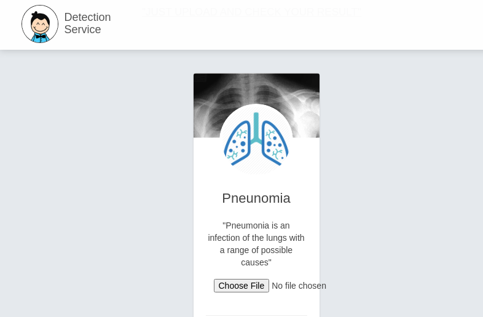
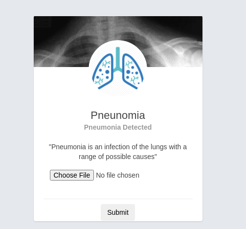

Disease Detection Using Deep Learning
 ==============================

Building Rest API for Disease Detection using Deep Learning for classification and FastAPI for serving.

## Problem:-

Traditional diagnosis system for pneumonia detection is very slow process. There should be specialist doctor for diagnosing X-ray diagnosis.  
But Using this Web service one can simply upload their X-ray and get result within seconds.

Here I am using Deep Learning models for Image processing and classification tasks which are very sophisticated in distinguish between normal and affeacted X-ray by analysing image features and upto very minute detail in image.

## Workflow:-

Normal workflow of the project is We have to train our Deep learning model using as much X-ray data as possible so that it can learn to classify them more robustly  
If we can automate the process of traning and deployment part of this then this will work as expected.   

The components i have used in this project are:-  

VGG16 model for image classification  
Kears with tensorflow backend for efficient computation and prediction.   

## Steps to use this API using docker:-

1). Simplt clone/download this repo into your local machine
2). With the help of docker you can easily access the application
    After downloading repo:
    1) docker build --tag detect .  (. represents current directory make sure you are in repo folder)
    2) docker run -publish 8000:8000 detect
    3) open 0.0.0.0:8000/prediction

## Technologies used:-
Deep Learning for Image classification  
FastAPI framework for serving the model  
Web Technologies (html, css, JS) for simple web interface  
Docker for Deployment and Portable API service

## Interface flow:-
# Home Page:-

# After Submitting X-ray image

